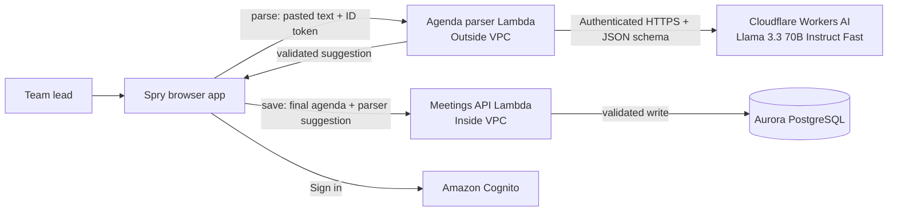

# Spry container diagram (C4 level 2)

```mermaid
flowchart LR
    Person[Team lead]
    Browser[Spry browser app]
    Parser[Agenda parser Lambda\nOutside VPC]
    Cloudflare[Cloudflare Workers AI\nLlama 3.3 70B Instruct Fast]
    API[Meetings API Lambda\nInside VPC]
    DB[(Aurora PostgreSQL)]
    Cognito[Amazon Cognito]

    Person --> Browser
    Browser -->|Sign in| Cognito
    Browser -->|parse: pasted text + ID token| Parser
    Parser -->|Authenticated HTTPS + JSON schema| Cloudflare
    Parser -->|validated suggestion| Browser
    Browser -->|save: final agenda + parser suggestion| API
    API -->|validated write| DB
```
